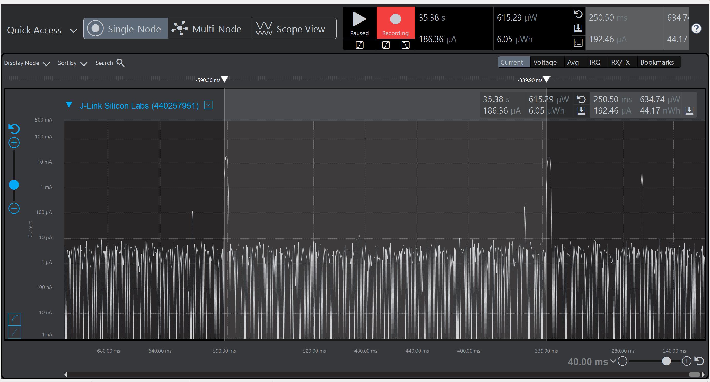

Please include your answers to the questions below with your submission, entering into the space below each question
See [Mastering Markdown](https://guides.github.com/features/mastering-markdown/) for github markdown formatting if desired.

_Be sure to take measurements with logging disabled to ensure your logging logic is not impacting current/time measurements._

_Please include screenshots of the profiler window detailing each current measurement captured. See the file Instructions to add screenshots in assignment.docx in the ECEN 5823 Student Public Folder._

1. Provide screen shot verifying the Advertising period matches the values required for the assignment.
    Screenshot:
   250.50ms
   

2. What is the average current between advertisements - i.e. when the MCU is sleeping in EM2. (Don't measure an interval with a LETIMER UF event)?
   Answer:
   2.61uA
    Screenshot:  
   

3. What is the peak current of an advertisement?

   Answer:
   27.93mA
    Screenshot:  
   

4. Provide screen shot showing the connection interval setting. Does the connection interval match the values you requested in your slave(server) code, or the master's(client) values?.

   I am getting 45ms connection interval which is within the range of 75ms, the master is requesting the connection in the interval of 45ms which overrides the slave settings.

    Screenshot:

   Printed value of connection interval on terminal -
   

   Connection interval observed through Energy Profiler -
   

5. What is the average current between connection intervals - i.e. when the MCU is sleeping in EM2. (Don't measure an interval with a LETIMER UF event)?

   Answer:
   2.40uA
    Screenshot:  
   

6. If possible, provide screen shot verifying the slave latency matches what was reported when you logged the values from event = gecko_evt_le_connection_parameters_id.
    Screenshot:
   Slave latency reported when I logged it from the event -

   
