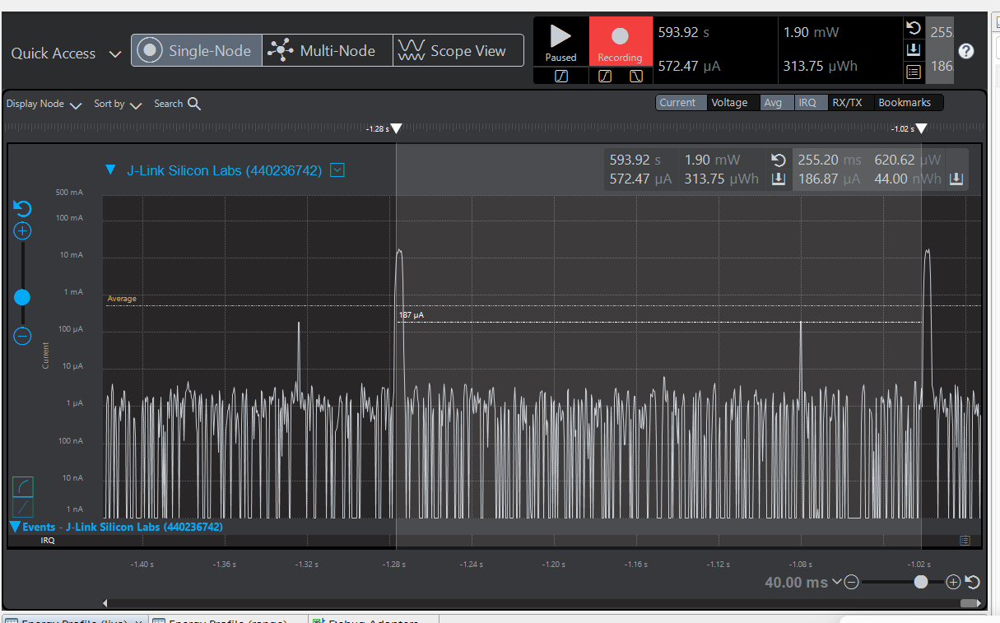
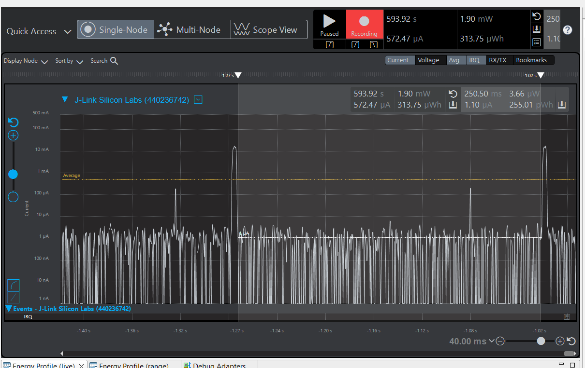
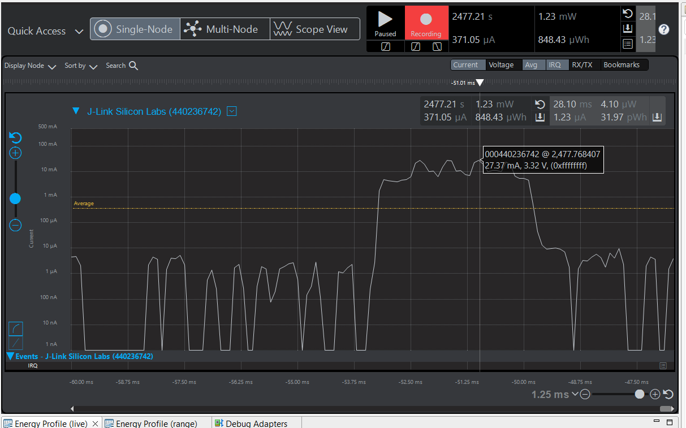
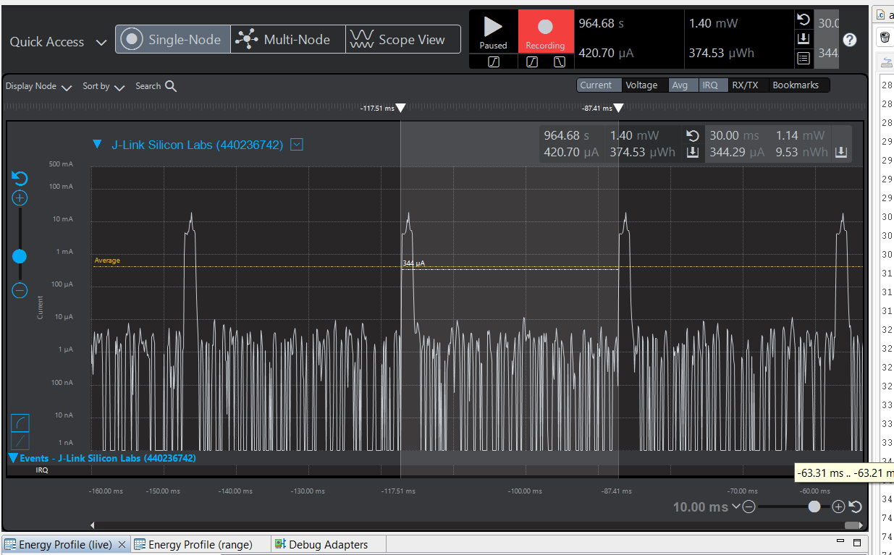
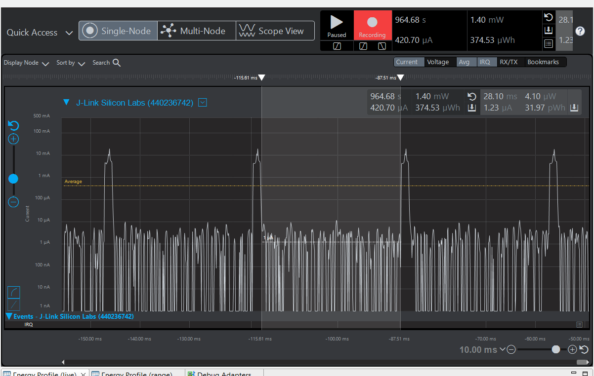
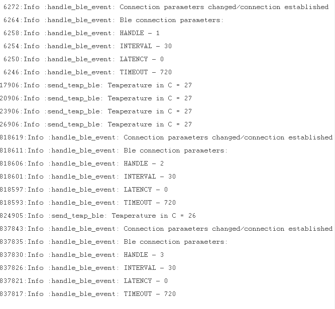

Please include your answers to the questions below with your submission, entering into the space below each question
See [Mastering Markdown](https://guides.github.com/features/mastering-markdown/) for github markdown formatting if desired.

*Be sure to take measurements with logging disabled to ensure your logging logic is not impacting current/time measurements.*

*Please include screenshots of the profiler window detailing each current measurement captured.  See the file Instructions to add screenshots in assignment.docx in the ECEN 5823 Student Public Folder.*

1. Provide screen shot verifying the Advertising period matches the values required for the assignment.
    Screenshot: 255.20 ms
     
   

2. What is the average current between advertisements - i.e. when the MCU is sleeping in EM2. (Don't measure an interval with a LETIMER UF event)?
   Answer: 1.10 uA
    Screenshot:  
     
   

3. What is the peak current of an advertisement? 
   Answer: 27.37 mA
    Screenshot:  
     
   

4. Provide screen shot showing the connection interval setting. Does the connection interval match the values you requested in your slave(server) code, or the master's(client) values?.
   Answer:30 ms
   The observed 30ms connection interval instead of the requested 75ms is expected due to BLE connection parameter negotiation, where the master has the final authority over connection settings.
    Screenshot: 
     
   

5. What is the average current between connection intervals - i.e. when the MCU is sleeping in EM2. (Don't measure an interval with a LETIMER UF event)?
   Answer:1.23 uA
    Screenshot:  
     
   

6. If possible, provide screen shot verifying the slave latency matches what was reported when you logged the values from event = gecko_evt_le_connection_parameters_id. 
   Answer: The reason the slave latency is reported as 0 despite setting it to 300/75 is because in BLE mechanism where the master dictates the final connection parameters. If low-latency behavior is preferred by the master, it overrides the requested slave latency, resulting in the observed behavior.
    Screenshot:  
     
   

