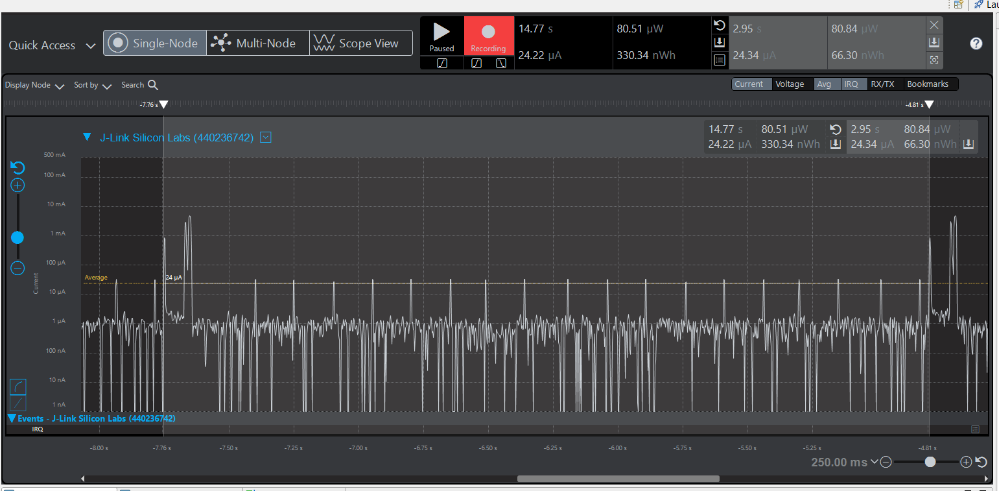
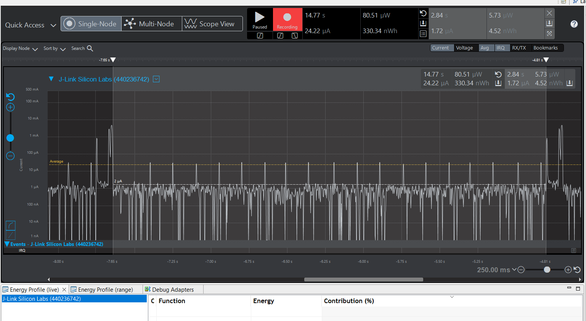
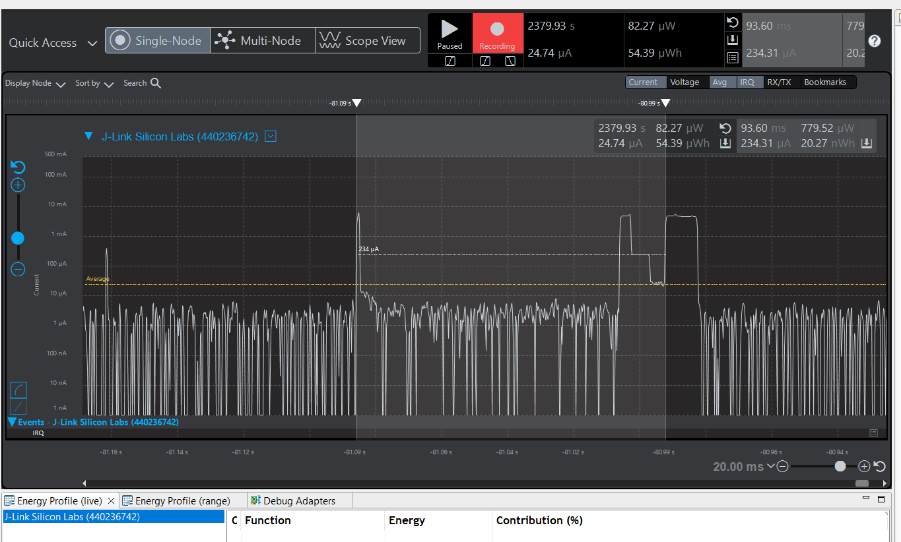
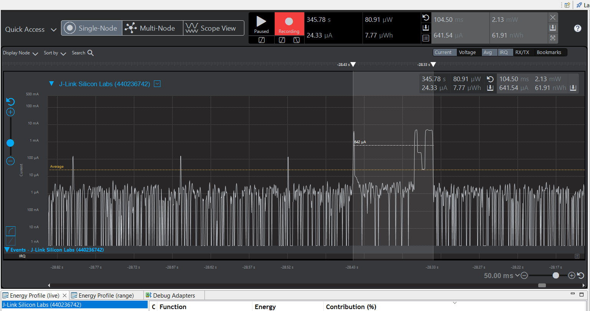

Please include your answers to the questions below with your submission, entering into the space below each question
See [Mastering Markdown](https://guides.github.com/features/mastering-markdown/) for github markdown formatting if desired.

*Be sure to take measurements with logging disabled to ensure your logging logic is not impacting current/time measurements.*

*Please include screenshots of the profiler window detailing each current measurement captured.  See the file Instructions to add screenshots in assignment.docx in the ECEN 5823 Student Public Folder.* 

1. What is the average current per period? (Remember, once you have measured your average current, average current is average current over all time. Average current doesn’t carry with it the units of the timespan over which it was measured).
   Answer:24.34 uA
    Screenshot:  
     
   

2. What is the ave current from the time we sleep the MCU to EM3 until we power-on the 7021 in response to the LETIMER0 UF IRQ?
   Answer:1.72 uA
    Screenshot:  
    
    

3. What is the ave current from the time we power-on the 7021 until we get the COMP1 IRQ indicating that the 7021's maximum time for conversion (measurement) has expired.
   Answer:
    Screenshot:  234.31 uA
     
   

4. How long is the Si7021 Powered On for 1 temperature reading?
   Answer:
    Screenshot:104.50 ms
     
   

5. Given the average current per period from Q1, calculate the operating time of the system for a 1000mAh battery? - ignoring battery manufacturers, efficiencies and battery derating - just a first-order calculation.
   Answer (in hours): 
Battery Life = (Battery Capacity) / (Average Current Consumption)  
Battery Capacity = 1000 mAh  
Average Current Consumption = 24.34 µA = 0.02434 mA  

**Battery Life:**  

Battery Life = 1000 / 0.02434 
             ≈ 41,070.64 hours
             ≈ 1,711 days ≈ 4.7 years

So, the system will operate for approximately **41,070 hours (or ~4.7 years)** with a 1000mAh battery.
   
6. How has the power consumption performance of your design changed since the previous assignment?
   Answer:
#### Average Current Consumption (Period) Reduction:
- **Assgn 3:** 160.58 µA
- **Assgn 4:** 24.34 µA
- **Improvement:** ~85% reduction in average current consumption.

#### ON State Current Reduction:
- **Assgn 3:** 4.83 mA
- **Assgn 4:** 641.54 µA
- **Improvement:** ~86.7% lower ON state power consumption.

#### OFF State Current Reduction:
- **Assgn 3:** 4.36 µA
- **Assgn 4:** 1.72 µA
- **Improvement:** ~60.5% lower OFF state power consumption.

#### Key Design Improvements:
- **TimerWaitUs implemented using IRQ:** Avoids active polling and enters a low-power state while waiting, reducing power consumption.
- **I2C operations using IRQ:** Eliminates busy-waiting, minimizing CPU wake time and improving power efficiency.

#### Final Impact:
With a **1000mAh battery**, the operating time increased from:
- **~6,200 hours (Assgn 3) to ~41,070 hours (Assgn 4)**  
- **Resulting in a 6.6x improvement!**
   

